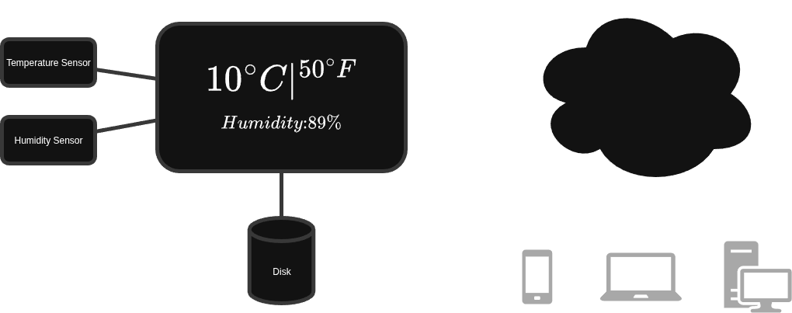

# Qt QML Display
A Qt QML temperature and humidity display. The display show the temperature in ***Celsius*** and ***Fahrenheit***, and the humidity level as percentage.

*Fig. 1- Display showing temperature and himidity.*