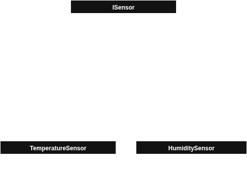

# Qt QML Display
A Qt QML temperature and humidity display. The display shows the temperature in ***Celsius*** and ***Fahrenheit***, and the humidity level as percentage. The temperature and humidity are saved into local storage. The data is optionally sent to a remote server (depends on server availability).


*Fig. 1- Display showing temperature and humidity.*

## System Specification
The system must emulate three sensors: the first is the temperature sensor in celsius, the second is the humidity sensor, and the third is the temperature sensor in fahrenheit. The third sensor updates its value converting the value read by the first sensor, thus whenever the first sensor is updated the third sensor also updates.

The data returned by the first and second sensors should be random. The first sensor **MUST** update in **2 seconds** intervals and the second sensor **MUST** update in **5 seconds** intervals.

The UI **MUST** show the sensors data in real-time, and each value read **MUST** be stored in local storage. Optionally, the data can be sent over a TCP/IP socket connection to a cloud service.

The system has a temperature and humidity alarm. The alarm is triggered by the temperature and humidity sensors after reaching a specific threshold. The UI **MUST** change to a fault state and show what caused the alarm to set. The alarm **MUST** reset after the condition is normalized and the UI **MUST** return to normal state.

***NOTE: Even though not required, we should consider implementing a hysteresis logic to avoid the edge case where the alarm will continuously trigger in the temperature/humidity threshold boundaries.***

First sensor data constraint:
- temperature in range from -40 to 150 degrees celsius inclusive;
- float number with one decimal.

Second sensor data constraint:
- humidity level in range from 0 to 100 inclusive;
- float number with one decimal.

Alarm trip conditions:
- temperature over 40 degree celsius or bellow 10 degrees celsius;
- humidity over 87% or bellow 40%.

The project **MUST** follow bellow requirements:
- Qt QML for UI content;
- Qt/C++ for logic;
- Sensor emulated in separated threads;
- TCP/IP socket.

## System Overview
The system could be viewed as two separate layers: a high level UI layer, and a low level application layer. The components for each layer is described bellow:

UI Layer:
- Qt QML: Holds the UI description and **MUST** not include application logic.

Application Layer:
- ***Core***: Loads the Qt QML description and manages all other components. It is also responsible for updating the UI content and UI state;
- ***Temperature/Humidity Sensor***: Generate sensor data;
- ***Alarm***: Notifies a fault condition to the system;
- ***Storage handler***: Handles the data storage operations, e.g. connection, read, write, etc;
- ***Cloud handler***: Handles the cloud service operations, e.g. connection, send data, etc;
- ***Storage***: The local storage implementation, e.g. database, text file, etc;
- ***Cloud Service***: Cloud service, e.g. Google, Amazon, etc.


*Fig. 2- System overview depicting high level and low level components.*

## System Design
The `class ISensor` is the interface of all concrete sensors. It should provide a way to get data from PHY sensor in a timed interval.



*Fig. 3- The `class ISensor` and its children.*

## Build Project
Requirement:
- Any C++ compiler with C++17 support.
- cmake

Build command using GCC:
```
mkdir build
export QT_VERSION=6.9.1
cmake -DCMAKE_PREFIX_PATH=~/Qt/6.9.1/gcc_64 -S ./ -B ./build/
cmake --build ./build/
```

Run command:
```
./build/appqml_display
```